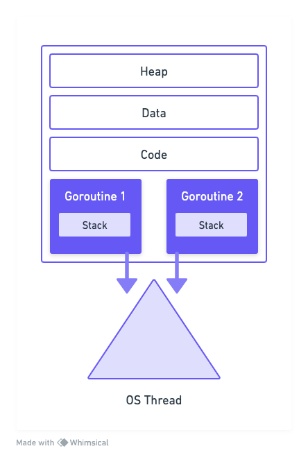
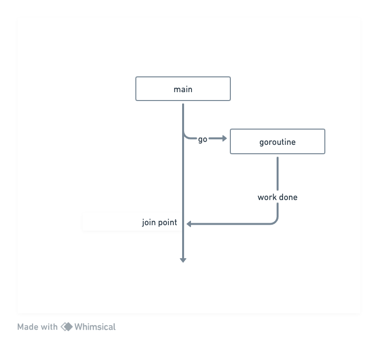

# Introduction
We will see how Go implements concurrency and how it overcomes some of the limitations with threads.

- Goroutines are concurrently executing functions
- Channels are used to communicate data between the goroutines.
- Select is used to multiplex the channels.
- Sync package provide classical sunchronization tools like the mutex, conditional variables and others.

## Goroutines
We can think Goroutines as user space threads managed by the go runtime. 
- Goroutines are extremely lightweight. They start with 2kb of stack, which grows and shrinks as required.
- They also have low CPU overhead. The amount of CPU instructions required to create a goroutine is very small (three instructions per function call).
- We can create hundreds of thousands of goroutines in the same address space.
- The data is communicated between goroutines with channels. Sharing of memory can be avoided.
- Context switching between goroutines is much cheaper than threads context switching, as goroutines have less state to store.
- Go runtime can be more selective in what is persisted for retrieval, how it is persisted, and when the persisting need to occur.

- Go runtime creates worker OS threads. **Goroutines run in the context of the OS thread.**
Many goroutines can execute in the context of the single OS thread. The operating system schedules, the OS threads and the go runtime schedules multiple goroutines on the OS thread.
For the operating system nothing has changed, it is still scheduling the threads as it was.
Go runtime manages the scheduling of the goroutines on the OS threads.

**Exercises are available at** https://github.com/andcloudio/go-concurrency-exercises.git

## Race condition
Race condiction occurs when order of execution is NOT guaranteed.

~~~go
func main() {
  var data int

  go func() {
    data++
  }()

  if data == 0 {
    fmt.Printf("the value is %v\n", data)
  }
}
~~~

Concurrent programs does not execute in the order they are coded. In this code snippet, we have a main routine and a goroutine which run concurrently. The goroutine is incrementing the value of the data, and the main routine is checking if the data is still zero. One of the complexities to manage in concurrency is race condition. This occurs when two or more operations must be executed in the correct order to produce the desired result. But the program has not been written so that order is guaranteed to be mantained.
Goroutines are executed asynchronously from the main routine. The order in which the main routine and the goroutine will execute is ***undeterministic***.
In the example, there are three possible outcomes:
- Nothing is printed
- "the value is 0"
- "the value is 1"

Can we make main() wait for the goroutine to execute before checking the value of data? This is where sync wait group comes into play.

Go follows a logical concurrency model called fork and join.
Go statement forks a goroutine. When the goroutine is done with its job, it joins back to the main routine.

If main does not wait for the goroutine, then it is very much possible that the program will finish before the goroutine gets a chance to run.

In order to create a join point, we use sync wait group, to deterministically block the main routine

~~~go
var wg sync.WaitGroup
wg.Add(1)
go func() {
  defer wg.Done()
  //...
}()

wg.Wait()
~~~

We create a variable of type `sync.WaitGroup`. We call the add method to indicate the number of goroutines that we are creating.
We call the `Done` method inside the goroutine enclousure to indicate that the goroutine is exiting. Usually it is called with the `defer`, to make sure that it gets called on all the exit points of the function.
the `Wait` method will block the main routine until all the goroutines have exited.

WaitGroup is like a concurrent counter. Call to `Add` increases the counter by the integer that is passed in. Call to `Done` will decrement the counter by one. Call to `Wait` will block the main routine until the counter becomes zero.

Here you notice that `Add` is called outside the goroutine enclosure. If the `Add` was placed within the goroutine, then it is very possible that the call to `Wait` was executed before the add method.
In that case, the main routine could return without blocking. Therefere, we call the `Add` method outside to make sure that it gets called before `Wait`.

## Goroutines & Closures
Goroutines execute within the **same address space** they are created in.
They can directly modify variables in the enclosing lexical block

This enables developers to write goroutines within the lexical block of the enclosing function as sequential code. 

~~~go
func inc() {
  var i int
  go func() {
    i++
    fmt.Println()
  }()
  return
}
~~~

The Go compiler and the runtime takes care of moving the variable from the stack to the heap, to facilitae goroutines, to have acces to the variable even after the enclosing function has returned.

