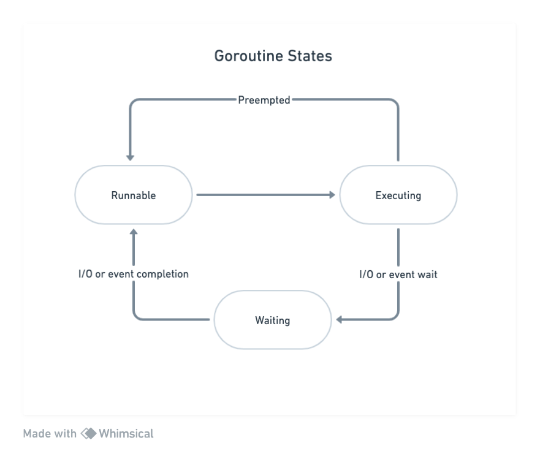
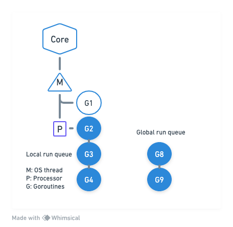
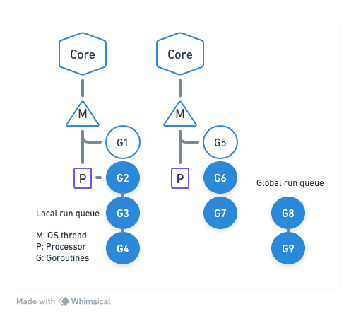
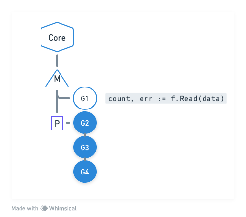
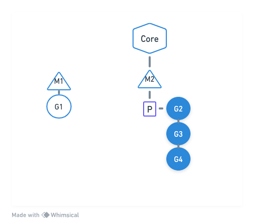
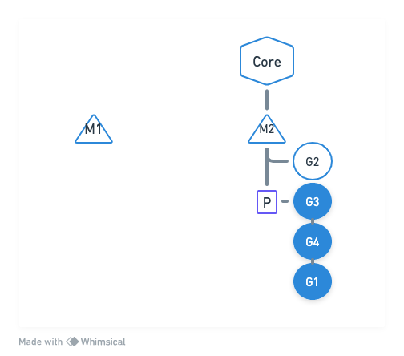
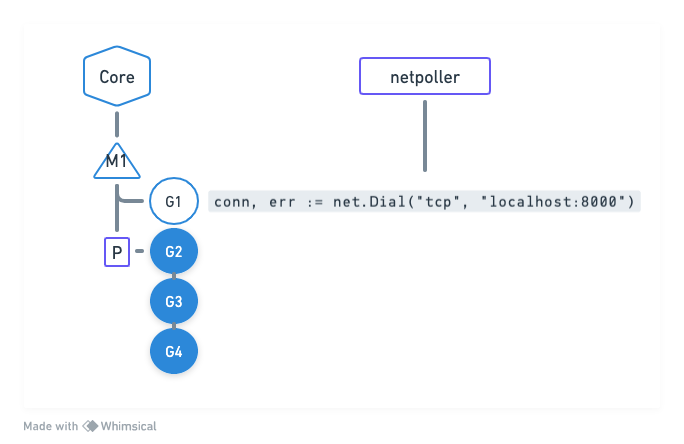
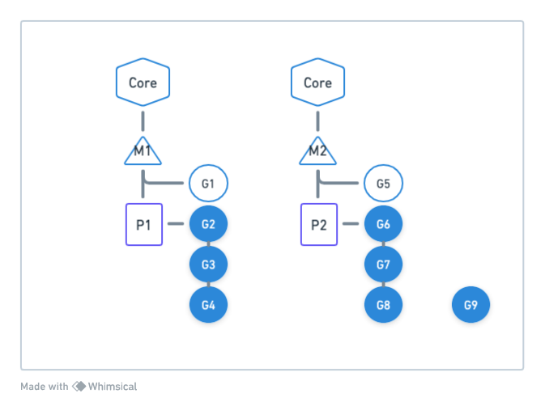

# Go Scheduler
Go scheduler is part of the Go runtime. It is built into the executable of the application. It is known as M:N scheduler.

Goroutines are scheduled on the OS threads by the Go scheduler. Go runtime creates a number of worker OS threads, equal to ***GOMAXPROCS*** enviroment variable value. The default value is the number of processors on the machine. So if we have 4 cores, then 4 OS threads will be created.

It is the responsibility of the Go Scheduler to distribute runnable goroutines over multiple OS threads that are created. At any time, ***N*** goroutines coul be scheduled on ***M*** OS threads that runs on at most ***GOMAXPROCS*** numbers of processors.

As of GO 1.14, the Go scheduler implements asynchronous preemption. This prevents long running goroutines from hogging onto CPU. that could block other goroutines.
In asynchronous preemption, what happens is that a goroutine is given a time slice of ten milliseconds for execution. When that time slice is over, Go scheduler will try to preempt it. This provides other goroutines the opportunity to run even when there are long running CPU bound goroutines scheduled. 

Similar to threads, goroutines also have states.

- When it is created, it will be in runnable state, waiting in the run queue.
- It moves to the Executing state once the goroutine is scheduled on the OS thread.
If the goroutine runs through its time twice, then it is preempted and placed back into the run queue.
- If the goroutine gets blocked on any condition. like blocked on channel, block on a syscall or waiting for the mutex lock, then they are moved to waiting state.
Once the I/O operation is complete, they are moved back to the runnable state.

## Different elements involved in Go scheduling
For a CPU core, Go runtime creates a OS thread, which is represented by the letter M.
OS thread works pretty much like POSIX threads.
Go runtime also creates a logical processor (P in the graphic), and associates that with the OS thread.

The logical processor holds the context for scheduling, which can be seen as a local scheduler running on a thread.

G1 represents a goroutine running on the OS thread. Each logical processor has a local run queue, where runnable goroutines are queued (colored circles).
There is a global run queue. Once the local queue is exhausted, the logical processor will pull goroutines from global run queue. When new goroutines are created, they are added to the end of the global run queue.

### Context switch
Goroutine G1 has reached a scheduling point. The logical processor will pop a goroutine from its ocal run queue (in this case G2), and set the stack and instruction pointer for the new goroutine. Then it begins running it. The previously running goroutine G1 is placed back into the local run queue.

As we can see, there is no change as far as the OS is concerned. It is still scheduling the same OS thread. The context switching between the goroutines is managed by the logical processor.

Here we have a two core representation. Go runtime creates another OS thread and logical processor.

## Context switching due to synchronous system call
What happens in general when a goroutine makes a synchronous system call, like reading or writing to a file?
Synchronous system calls wait for I/O operation to be completed. Due to which the OS thread can be moved out of the CPU and placed in the waiting queue for the I/O to be complete. We will not be able to schedule any other gorutine on that thread. 

The implication is that synchronous system calls can reduce parallelism.

So how does Go scheduler handle this scenario?

When a goroutine makes a synchronous system call, like reading on a file, that will make the OS thread (M1) to block.

Go scheduler identifies this block, so it brings in a new OS thread, either from the thread pool cache or it creates a new OS thread.
Then Go scheduler will detach the logical processor from the OS thread, and move it to the new OS thread. G1 is still attached to the old thread. The logical processor can now schedule other goroutines in its local run queue for execution on the second OS thread.

Once the synchronous system call that was made by G1 is complete, then it is moved back to the end of the local run queue, on the logical processor.
The first OS thread is put to sleep and placed in the thread pool cache, so it can be utilized in the future.

## Context switching due to asynchronous system call
Asynchronous system calls happen when the file descriptor that is used for doing network I/O operations is set to non-blocking mode.

If the file descriptor is not ready, for example:
- If the socket buffer is empty and we are trying to read from it
- If the socket buffer is full and we are trying to write to it

Then the read or the write operation does not block, but returns an error.

The application will have to retry the operation again at a later point in time.

This increases the application complexity. The application will have to create an event loop, and set up callbacks, or it has to mantain a table mapping the file descriptor to the function pointer, and it has to mantain a state to keep track of how much data was read last time, or how much data was written last time.

If it is not implemented properly, then it does make the application a bit inefficient. How does Go handle this scenario?

### netpoller
Go uses netpoller. This is an abstraction built in the syscall package. It converts asynchronous system calls to blocking system calls.

When a goroutine makes an asynchronous system call, and the file descriptor is not ready, then the Go scheduler uses netpoller OS thread to park that goroutine. The netpoller uses the interface provided by the operating system, like epoll on Linux, kqueue on MacOS, iocp on Windows, to poll on the file descriptor.

Once the netpoller gets a notification from the operating system, it in-turn notifies the goroutine to retry the I/O operation.
This way, the complexity of managing asynchronous system calls is moved from the application to the go runtime.

The application does not need to make a call to select or poll and wait for the final descriptor to be ready, but instead it will be done by the netpoller in an efficient manner.

Here G1 is executing on the OS thread M1. G1 opens a network connection with net.Dial. The file descriptor used for the connection is set to non-blocking mode.

When the goroutine tries to read or write to the connection the networking code will do the operation until it receives an error EAGAIN.

Then it calls into the netpoller. The scheduler will move the goroutine out of the OS thread to the netpoller thread. Another goroutine in the local run queue gets scheduled to run on the OS thread.

The netpoller uses the interface provided by the operating system to poll on the file descriptor. When the netpoller receives the notification from the operating system that it can perform an I/O operation on the file descriptor, then it will look through its internal data structure, to see if there are any goroutines that are blocked on that file descriptor.

It notifies the goroutine to retry the I/O operation. Once the operation is complete, the goroutine is moved back to the local run queue and it will be processes by the OS thread when it gets a chance to run.

This way, to process an asynchronous system call, no extra OS thread is used. Instead the netpoller OS thread is used to process the goroutines.

## Work Stealing
Work Stealing helps to balance the goroutines across all logical processors. Work gets better distributed and gets done more efficiently.

Here we have a multithreaded go program. We have 2 OS threads and 2 logical processors. The goroutines are distributed among the logical processors.

What happens if one of the logical processors services all its goroutines quickly? P1 has no more goroutines to execute, but there are goroutines in runnable state in the global run queue and local run queue of P2.

The work stealing rule says 
- If there are no goroutines in the local run queue, then try to steal from other logical processors.
- If not found, check the global run queue for the goroutines.
- If not found, check the netpoller.

In this case P1 does not have any runnable goroutines in its local run queue, so it randomly picks another logical processor (P2 in this case), and steals half of its goroutines from its local run queue. It this example it may steal goroutines G7 and G8.

Now we are able to bettwer utilize the CPU cores, and the work is fairly distributed between multiple logical processors.
What happens when P2 finishes executing all its goroutines and P1 does not have any goroutines in its local queue? Then, according to work stealing, P2 will look into the global run queue, and find G9. This goroutine will then be scheduled on M2.
