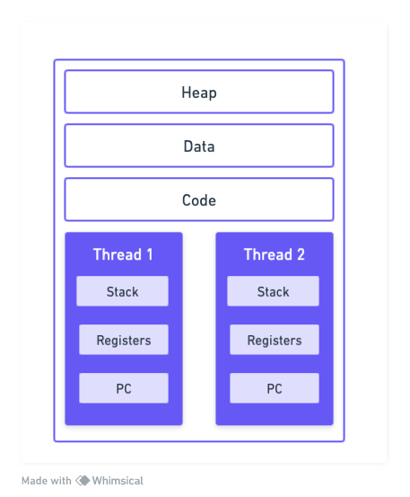
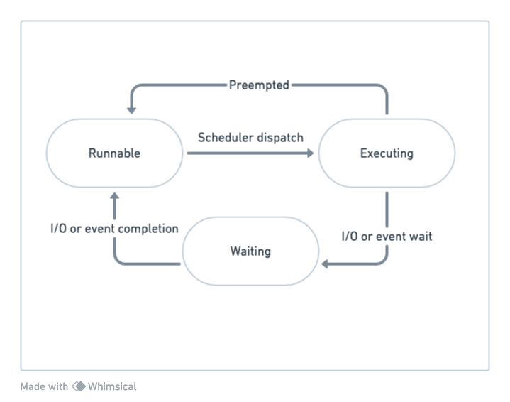
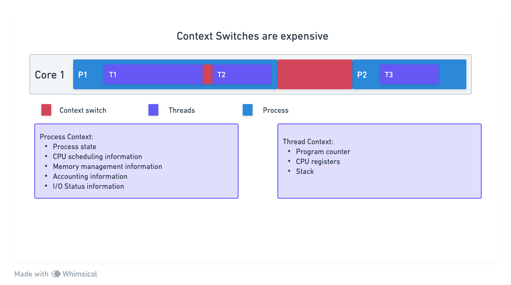

# Concurrency in Go
## Overview of Concurrency
Concurrency is about multiple things happenning at the same time in random order. Go provides a built in support for concurrency. It is not using an external library as other languages do, but higher level abstraction is built in, which makes writing concurrent code clean and elegant.

Lets take an example

~~~go
func Add(numbers []int) int64 {
    var sum int64
    for _, n := range numbers {
        sum += int64(n)
    }
    return sum
}
~~~

This is a simple addition function. It takes a slice of integers as input. It loops over those integers, computes the sum and returns the sum. If we passed a slice of millions of numbers as input, then it is going to take some time to compute the sum.

- When Add() is executed it runs on a single core.
- To make the computation run faster, we could divide the input slice into multiple slices, and run the add function on each part of the slice, in parallel on different cores. This way, we will be doing our computation much faster.

~~~go
func AddConcurrent(numbers []int) int64 {
    // utilize all cores on machine
    numOfCores := runtime.NumCpu()
    runtime.GOMAXPROCS(numOfCores)

    var sum int64
    max := len(numbers)

    sizeOfParts := max / numOfCores

    var wg sync.WaitGroup

    for i := 0; i < numOfCores; i++ {
        // Divide the input into parts
        start := i * sizeOfParts
        end := start + sizeOfParts
        part := numbers[start:end]

        // Run computation for each part in separate goroutines
        wg.Add(1)
        go func(nums []int){
            defer wg.Done()
            var partSum int64

            // Calculate sum for each part
            for _, n := range.nums {
                partSum += int64(n)
            }

            // Add sum of each part to cummulative sum
            atomic.AddInt64(&sum, partSum)
        }(part)
    }
    wg Wait()
    return sum
}
~~~
## Concurrency
Concurrency is composition of independent execution computations, which may or may not run in parallel.
Is about dividing the problem into multiple independent computations, that may run sequentially or in parallel. In either case, whether the computation is running in one way or another, the outcome needs to be the same.

## Parallelism
Is the ability to execute multiple computations simultaneously. We need more than one CPU core to run the instructions in parallel. If a task depends on other tasks, then they still need to be executed sequentially. So having more cpu cores does not always make the process faster, unless the tasks are designed to work independently.
Concurrency enables parallelism.

## Processes and threads
### Why was there a need to build concurrency primitives in GO?
We need a refresher on the concept of operating systems, processes and threads. The idea of concurrency comes from the operating system.
### Operating system
The job of an operating system is to give fair chance for all processes access to CPU, memory and other resources. Mos of the time, it gives equal opportunity to all the processes, and there are times when the higher priority task can take precedence. The idea of cuncurrency starts with processes.

A process is an instance of a running program. The process provides an enviroment for the program to execute. When the program is executed, the operating system creates a process and allocates memory un the virtual addess space.

The virtual address space will contain code segment, which is the compiled machine code.
The heap sement is the one which is used for dynamic memory allocation, and the stack is used for storing local variables of a function.

### Threads
Threads are the smalles unit of execution that a CPU accepts.
Each process has at least one thread (main thread). Process can have multiple threads, and they share the same address space.

Each thread has its own stack.

Threads run independent of each other. OS scheduler makes scheduling decisions at thread level, not process level.

Threads can run concurrently, with each thread taking turn on the individual core, or in parallel, with each thread runnning at the same time on different cores.

### Thread states
When a process is created, the main thread is put into the ready queue. It is in the runnable state.
Once the CPU is avialable, the thread starts to execute. Each thread is given a time slice. If that time slice expires, then the thread gets preempted and placed back on the queue.

If the thread gets blocked due to an I/O operation, like read/write on disc or network operation, or waiting for the event from other processes, then it is places in the waiting operation, until the I/O operation is complete.

Once it is complete, it is palces back onto the ready queue.

We can divide our application into processes and threads to achieve concurrency, but there are limitations

### Context switching
Context switching is considered expensive. CPU has to spend time copying the context of the current executing thread into memory and restoring the context of the next chosen thread. It does take thousands of CPU instrutions to do context swithching, and it is a wasted time, as CPU is nnot running the application during context switching.

As we can see, the context switching between threads of the same process is relatively cheap compared to context switching between threads of different processes.

Can we scale the number of threads per process? Not much actually.

If we scale the number of threads in a process too high, then we might hit the  C10k problem.

### C10k Problem
Scheduler allocates a process a time slice for execution on CPU core. This CPU time slice is divided equally amon threads. If we define a scheduler period as to miliseconds and we have two threads, then each thread is going to get five milliseconds separately for execution. If we have five threads, then each thread is going to get two milliseconds to execute.

But what if there are a thousand threads? Then each thread will get 10 milliseconds. This would be bad, as CPU will be spending more time in context switching than running the application.
So to do any meaningful job, a thread needs to at least a minimum of two milliseconds.

If a minimum time for the thread is two milliseconds and accordingly we said this scheduler period, then to execute a thousand threads, the scheduler will take two seconds. If there are 10 thousand threads, it will take 20 second to complete one cycle of the execution, and each thread will have to wait for 20 seconds for its next execution.

### Fixed stack size
Other issue is the stack size. The operating system gives a fixed stack size for each thread. The actual size depends on the hardware. So if we had 8MB of stack size, and 8GB of memory, then in theory we could only create 1000 threads.
The fixed stack size limits the number of threads that we can create to the amount of memory we have.

## Why Concurrency is hard?
### Shared memory
Threads communicate between each other by sharing memory. They share the heap and the data region of the process, and threads communicate with each other by sharing memory. This creates a lot of complexity, with concurrently executing threads. Concurrent acces to shared memory by two or more threads can lead to `Data Race`, and outcome can be undeterministic.

